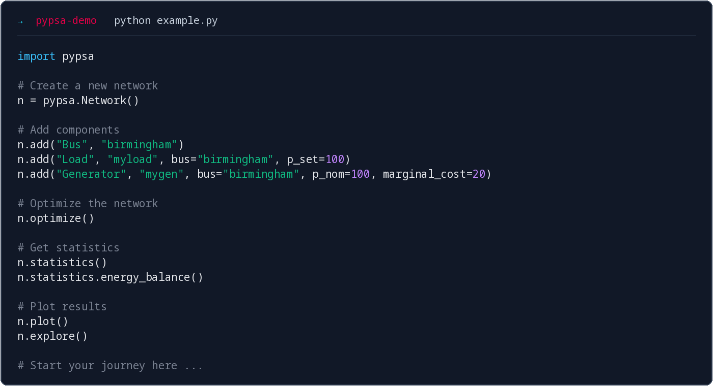

# PyPSA Workshop Birmingham

**10–11 September 2026**  
**University of Birmingham · United Kingdom**  
*Hosted by the
[Supergen Energy Networks Hub](https://www.supergen-networks.org.uk/) and
delivered by [PyPSA Labs](https://pypsalabs.org/).*

---

## Course outline

This two-day workshop introduces [PyPSA](https://docs.pypsa.org/), an
open-source Python package for energy system modelling and energy infrastructure
planning. It also explores [PyPSA-Eur](https://pypsa-eur.readthedocs.io/), a
European energy system model and data pipeline maintained at TU Berlin.

### What you will learn

- **PyPSA fundamentals:** Data structures and fundamental components,
	formulation of optimisation problems, results retrieval and visualisation
- **Capacity expansion:**  Capacity planning problems with PyPSA
- **Stochastic and risk-averse optimisation:** Handling uncertainty and risk management in energy system models
- **Sector coupling:** Multi-carrier networks and energy conversion
- **Other features:** Custom constraints, the statistics module, network explorer. 
- **PyPSA-Eur:** A tour through to the European energy system model workflow and data pipeline

Some familiarity with Python and `pandas` is helpful, but not required. Short introductions to both are included in the annexes.

## Preliminary agenda

:::{div}
:class: workshop-agenda-day

### Day 1 — Thursday, 10 September 2026

| Time | Session |
|---|---|
| 09:00–10:00 | *Soft start: arrival, coffee, getting to know each other* |
| 10:00–11:00 | **Introduction to the PyPSA ecosystem** |
| 11:00–11:15 | *Break* |
| 11:15–12:30 | **Introduction to optimisation with PyPSA** |
| 12:30–13:30 | *Lunch* |
| 13:30–15:00 | **Modelling with PyPSA: system capacity planning, sector coupling, results retrieval and statistics** |
| 15:00–15:15 | *Break* |
| 15:15–17:00 | **PyPSA-Eur workflow: introduction and hands-on modelling** |
| 17:00–17:30 | **Wrap-up of day 1 and open questions** |
| From 18:30 | *Shared dinner at Stable Pizza (Birmingham city centre)* |

:::

:::{div}
:class: workshop-agenda-day

### Day 2 — Friday, 11 September 2026

| Time | Session |
|---|---|
| 09:00–10:45 | **PyPSA-Eur: a deeper look at the workflow** |
| 10:45–11:00 | *Break* |
| 11:00–12:30 | **Modelling with PyPSA: stochastic optimisation and risk aversion** |
| 12:30–13:30 | *Lunch* |
| 13:30–15:00 | **Modelling with PyPSA: security of supply analysis** |
| 15:00–15:15 | *Break* |
| 15:15–17:00 | **Open Q&A: PyPSA functionality, workflows, and your own modelling questions** |

:::

## Lecturers

[Dr. Fabian Neumann](https://fneum.org) and [Dr. Iegor Riepin](https://iriepin.com/) are postdoctoral researchers at the
[Department of Digital Transformation in Energy Systems](https://www.tu.berlin/en/ensys)
at [Technische Universität Berlin](https://www.tu.berlin/en). Their research work focuses on  identifying cost-effective pathways to climate neutrality, leveraging energy modelling to inform policy and public discourse. 

Fabian and Iegor are also co-founders
of [PyPSA Labs](https://pypsalabs.org/). 

## Technical setup

### Google Colab

You can run the notebooks in your browser without installing dependencies locally, using [Google Colab](https://colab.research.google.com/). For that, on any notebook page, click **🚀 Open this notebook in Google Colab**. Colab opens the notebook directly from GitHub; a Google account is required.

### Local installation

If you are DIY person and want to run the notebooks on your own computer, you can follow the instructions on the next page. You will need to install Python and some additional packages. The instructions are provided for both `uv` and `conda` users.